# Model Explainability Report

| | |
|---|---|
| **Model tested** | `Bank Marketing - 2-layer ANN` |
| **Endpoint** | `http://0.0.0.0:8000/bank_marketing` |
| **Task type** | classification |
| **Data points analyzed** | 50 |
| **Report generated** | 2026-09-15 19:01 |

---

A sensitivity score indicates how strongly each factor influences the model's output; a higher score means that factor has a bigger effect on the prediction. The scores provided below are normalized to a 0-1 scale, representing each feature's share of total measured sensitivity.

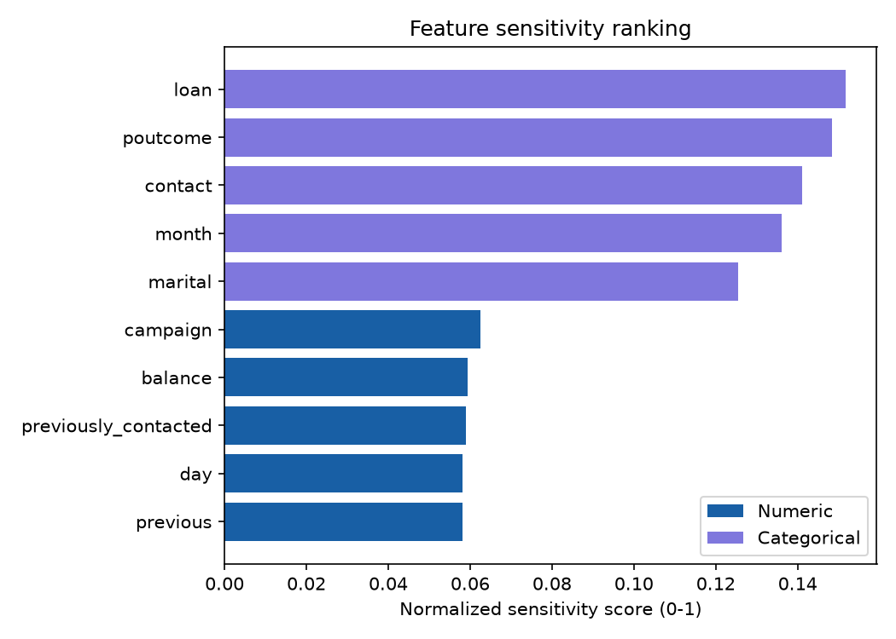

The following examples illustrate specific real scenarios and highlight what most influenced each prediction made by the model.

<table style="width:100%; border-collapse:collapse;"><tr><td style="width:50%; padding:8px; vertical-align:top;">
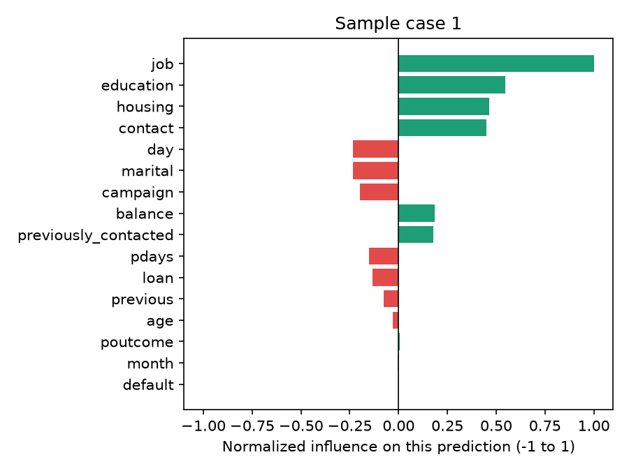
<strong>Input values:</strong>
<ul style="font-size:12px; margin:4px 0; padding-left:18px;"><li><strong>age</strong>: 29.00</li><li><strong>balance</strong>: 1,200.00</li><li><strong>day</strong>: 5.00</li><li><strong>campaign</strong>: 2.00</li><li><strong>pdays</strong>: 10.00</li><li><strong>previous</strong>: 1.00</li><li><strong>previously_contacted</strong>: 0.00</li><li><strong>job</strong>: blue-collar</li><li><strong>marital</strong>: single</li><li><strong>education</strong>: secondary</li><li><strong>default</strong>: no</li><li><strong>housing</strong>: yes</li><li><strong>loan</strong>: no</li><li><strong>contact</strong>: cellular</li><li><strong>month</strong>: jan</li><li><strong>poutcome</strong>: success</li></ul>
<strong>Predicted probability:</strong> 0.998

</td><td style="width:50%; padding:8px; vertical-align:top;">
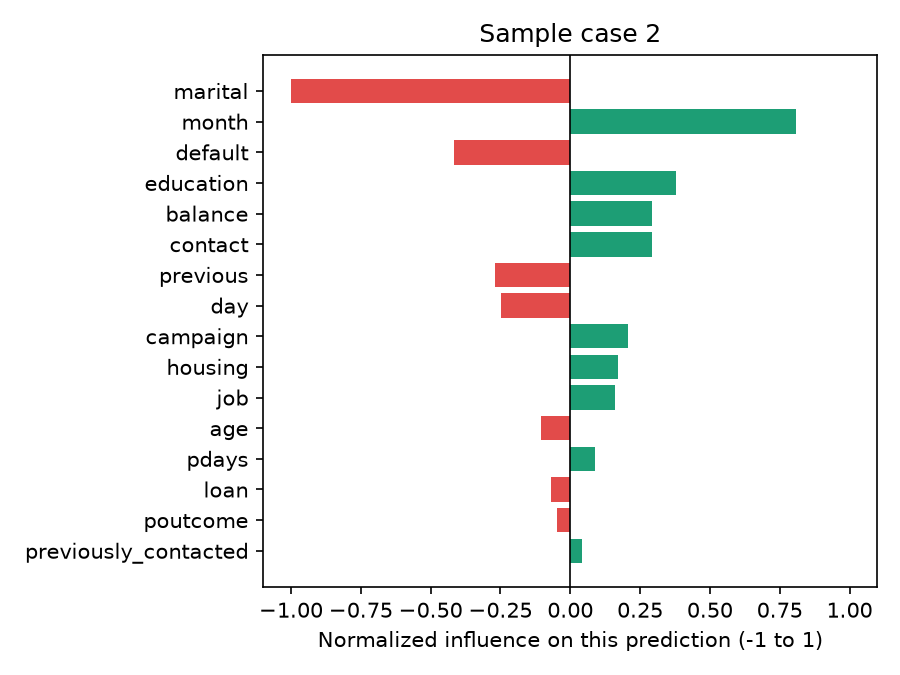
<strong>Input values:</strong>
<ul style="font-size:12px; margin:4px 0; padding-left:18px;"><li><strong>age</strong>: 47.00</li><li><strong>balance</strong>: 5,000.00</li><li><strong>day</strong>: 10.00</li><li><strong>campaign</strong>: 3.00</li><li><strong>pdays</strong>: 30.00</li><li><strong>previous</strong>: 0.00</li><li><strong>previously_contacted</strong>: 0.00</li><li><strong>job</strong>: management</li><li><strong>marital</strong>: married</li><li><strong>education</strong>: secondary</li><li><strong>default</strong>: yes</li><li><strong>housing</strong>: no</li><li><strong>loan</strong>: yes</li><li><strong>contact</strong>: telephone</li><li><strong>month</strong>: mar</li><li><strong>poutcome</strong>: failure</li></ul>
<strong>Predicted probability:</strong> 0.859

</td></tr></table>

The charts below demonstrate how the predicted output changes as each factor varies, while other factors remain typical of the dataset.

<table style="width:100%; border-collapse:collapse;"><tr><td style="width:50%; padding:8px; vertical-align:top;">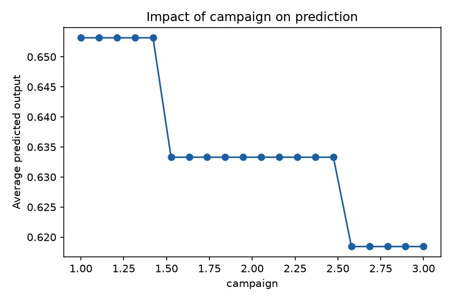
<strong>campaign</strong>
</td><td style="width:50%; padding:8px; vertical-align:top;">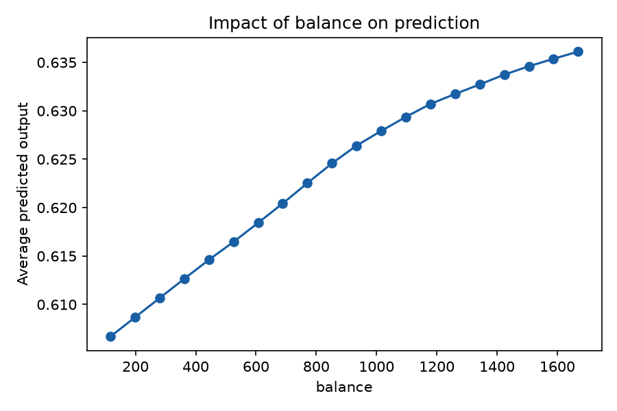
<strong>balance</strong>
</td></tr></table>

<table style="width:100%; border-collapse:collapse;"><tr><td style="width:50%; padding:8px; vertical-align:top;">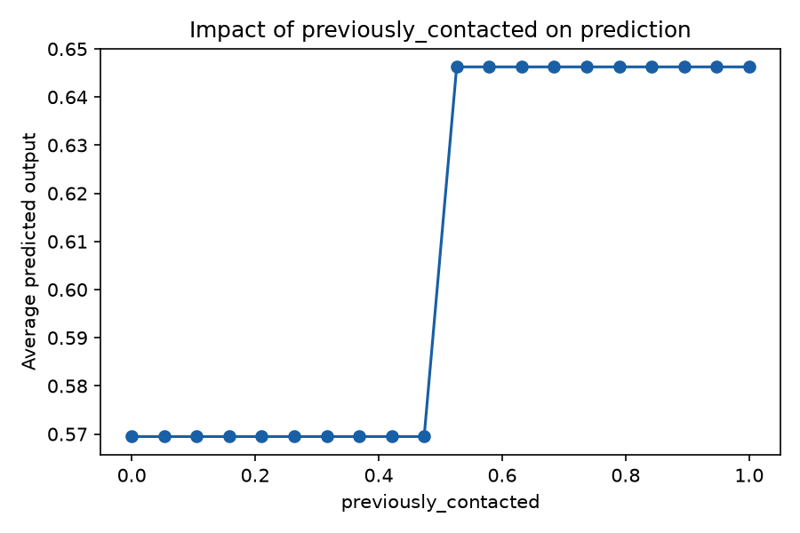
<strong>previously_contacted</strong>
</td><td style="width:50%; padding:8px; vertical-align:top;">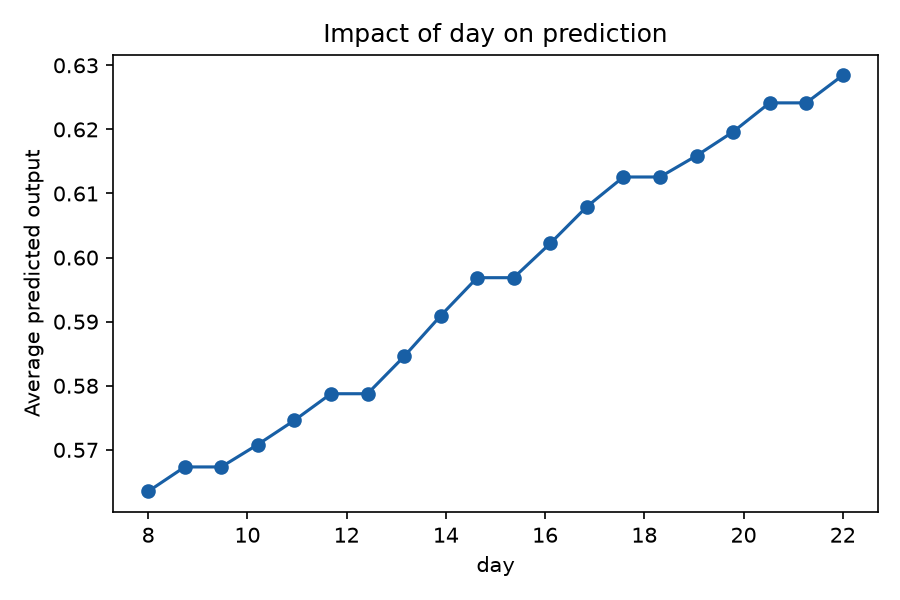
<strong>day</strong>
</td></tr></table>

<table style="width:100%; border-collapse:collapse;"><tr><td style="width:50%; padding:8px; vertical-align:top;">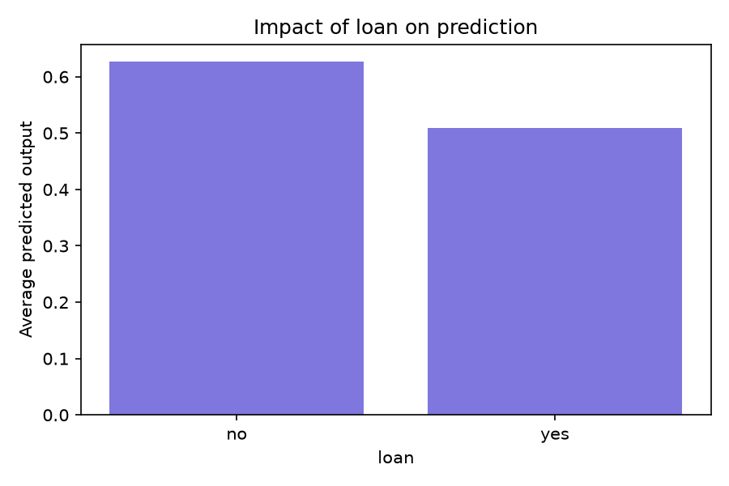
<strong>loan</strong>
</td><td style="width:50%; padding:8px; vertical-align:top;">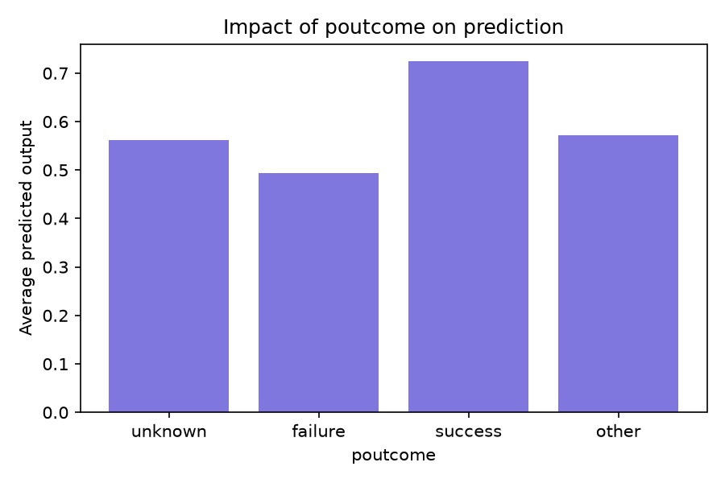
<strong>poutcome</strong>
</td></tr></table>

<table style="width:100%; border-collapse:collapse;"><tr><td style="width:50%; padding:8px; vertical-align:top;">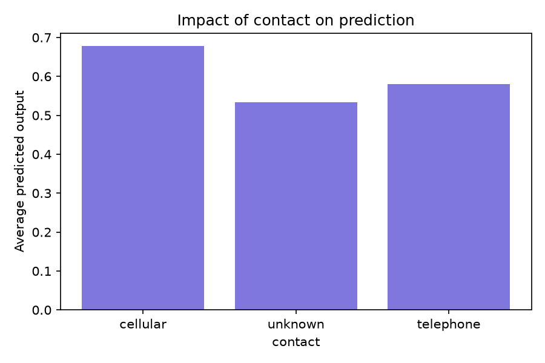
<strong>contact</strong>
</td><td style="width:50%; padding:8px; vertical-align:top;">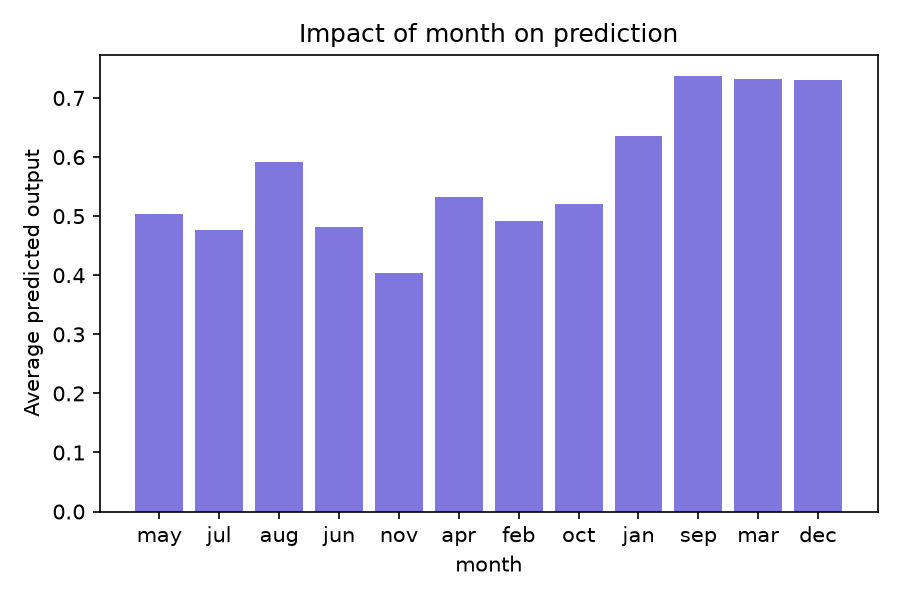
<strong>month</strong>
</td></tr></table>

These results should be used as a starting point for review and further analysis, rather than a final verdict on the model's performance.