# Model Explainability Report

| | |
|---|---|
| **Model tested** | `Bank Marketing - Logistic Regression` |
| **Endpoint** | `http://0.0.0.0:8000/bank_marketing` |
| **Task type** | classification |
| **Data points analyzed** | 50 |
| **Report generated** | 2026-09-15 18:48 |

---

A sensitivity score indicates how much each factor affects the model's predictions. A higher score signifies a greater influence on the outcome. The scores presented here are normalized on a scale of 0 to 1, reflecting the relative importance of each feature in contributing to the model's predictions.

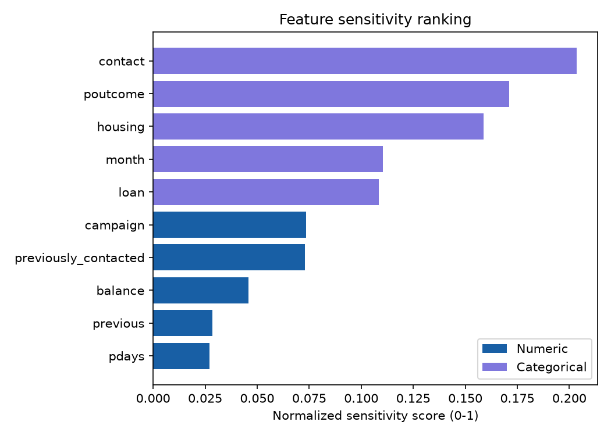

The following examples illustrate specific real scenarios and highlight what factors most influenced each prediction.

<table style="width:100%; border-collapse:collapse;"><tr><td style="width:50%; padding:8px; vertical-align:top;">
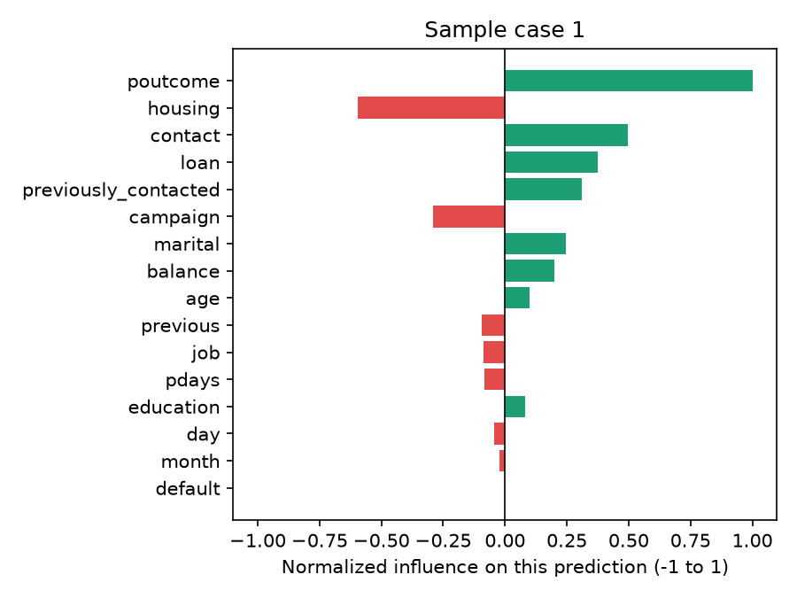
<strong>Input values:</strong>
<ul style="font-size:12px; margin:4px 0; padding-left:18px;"><li><strong>age</strong>: 34.00</li><li><strong>balance</strong>: 12,893.00</li><li><strong>day</strong>: 21.00</li><li><strong>campaign</strong>: 1.00</li><li><strong>pdays</strong>: 12.00</li><li><strong>previous</strong>: 1.00</li><li><strong>previously_contacted</strong>: 0.00</li><li><strong>job</strong>: services</li><li><strong>marital</strong>: single</li><li><strong>education</strong>: tertiary</li><li><strong>default</strong>: no</li><li><strong>housing</strong>: yes</li><li><strong>loan</strong>: no</li><li><strong>contact</strong>: cellular</li><li><strong>month</strong>: may</li><li><strong>poutcome</strong>: success</li></ul>
<strong>Predicted probability:</strong> 0.785

</td><td style="width:50%; padding:8px; vertical-align:top;">
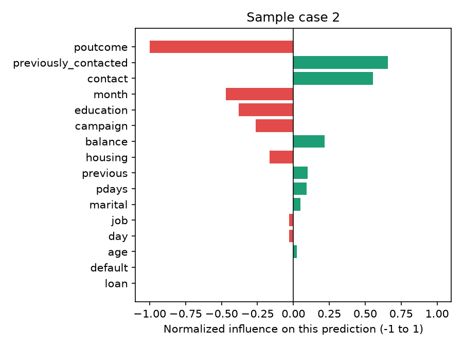
<strong>Input values:</strong>
<ul style="font-size:12px; margin:4px 0; padding-left:18px;"><li><strong>age</strong>: 29.00</li><li><strong>balance</strong>: 2,500.00</li><li><strong>day</strong>: 8.00</li><li><strong>campaign</strong>: 1.00</li><li><strong>pdays</strong>: 120.00</li><li><strong>previous</strong>: 0.00</li><li><strong>previously_contacted</strong>: 0.00</li><li><strong>job</strong>: services</li><li><strong>marital</strong>: divorced</li><li><strong>education</strong>: primary</li><li><strong>default</strong>: no</li><li><strong>housing</strong>: yes</li><li><strong>loan</strong>: no</li><li><strong>contact</strong>: cellular</li><li><strong>month</strong>: nov</li><li><strong>poutcome</strong>: unknown</li></ul>
<strong>Predicted probability:</strong> 0.382

</td></tr></table>

The charts below demonstrate how variations in each factor can lead to changes in the predicted output, while keeping other factors consistent with typical values from the dataset.

<table style="width:100%; border-collapse:collapse;"><tr><td style="width:50%; padding:8px; vertical-align:top;">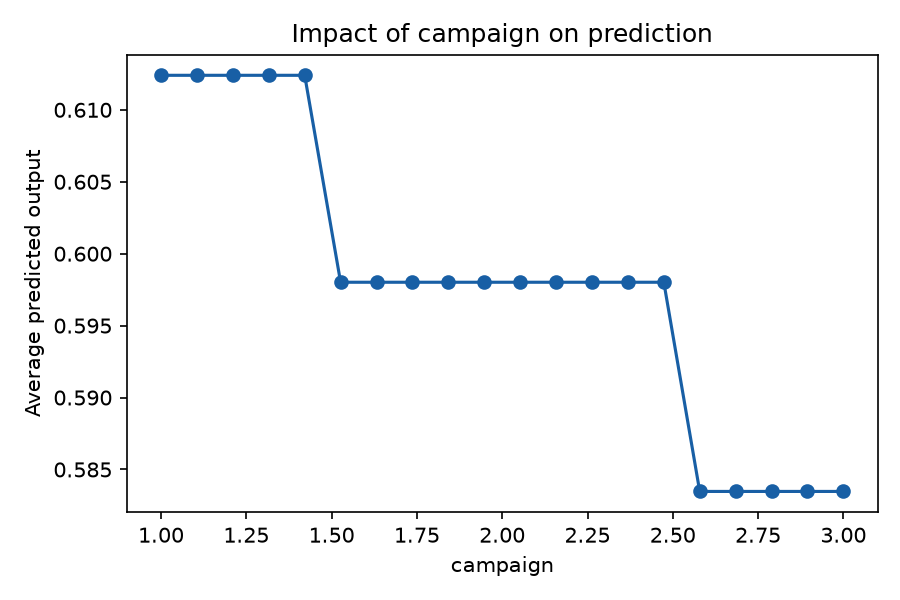
<strong>campaign</strong>
</td><td style="width:50%; padding:8px; vertical-align:top;">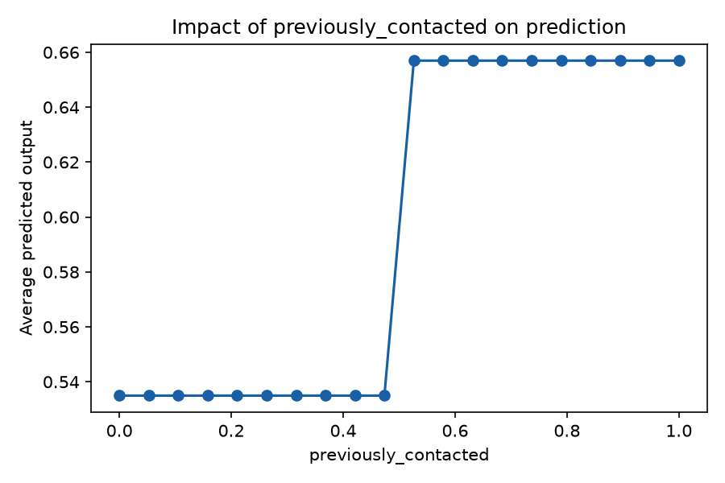
<strong>previously_contacted</strong>
</td></tr></table>

<table style="width:100%; border-collapse:collapse;"><tr><td style="width:50%; padding:8px; vertical-align:top;">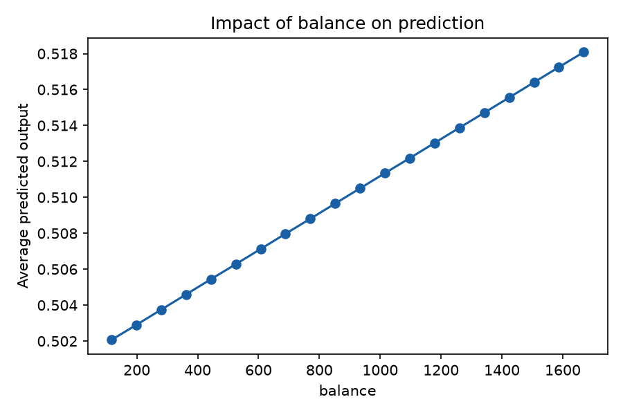
<strong>balance</strong>
</td><td style="width:50%; padding:8px; vertical-align:top;">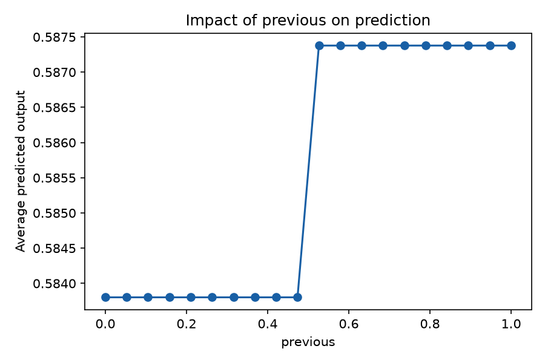
<strong>previous</strong>
</td></tr></table>

<table style="width:100%; border-collapse:collapse;"><tr><td style="width:50%; padding:8px; vertical-align:top;">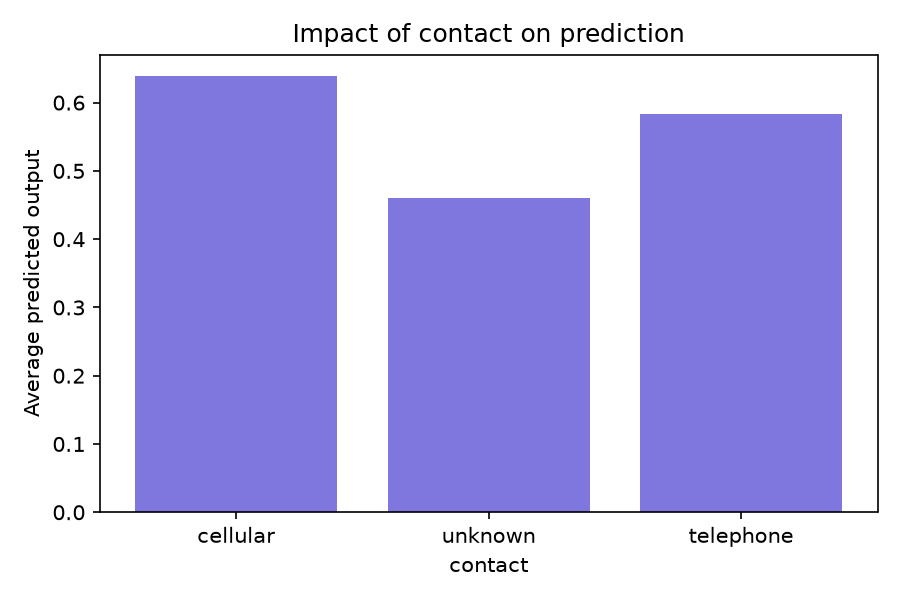
<strong>contact</strong>
</td><td style="width:50%; padding:8px; vertical-align:top;">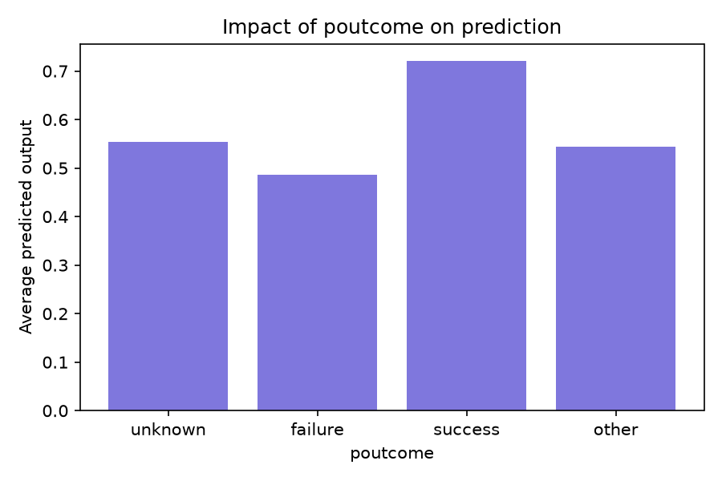
<strong>poutcome</strong>
</td></tr></table>

<table style="width:100%; border-collapse:collapse;"><tr><td style="width:50%; padding:8px; vertical-align:top;">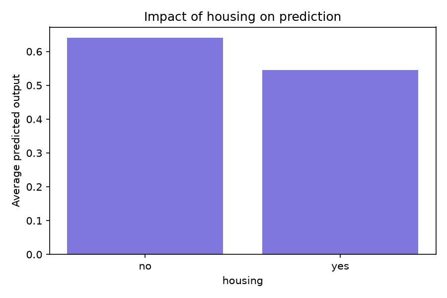
<strong>housing</strong>
</td><td style="width:50%; padding:8px; vertical-align:top;">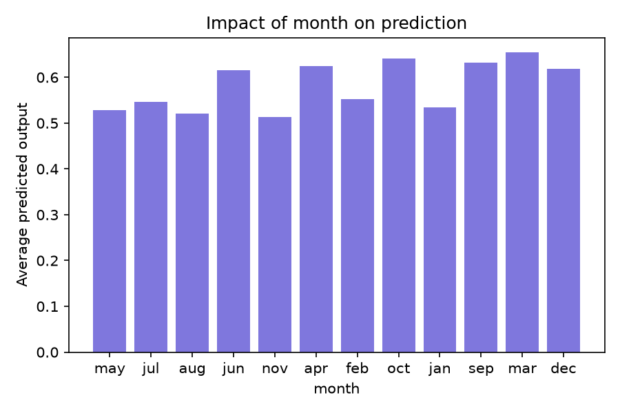
<strong>month</strong>
</td></tr></table>

These results should be considered a starting point for review and discussion, rather than a definitive conclusion.