# Model Explainability Report

| | |
|---|---|
| **Model tested** | `House Price - ElasticNet Linear Regression` |
| **Endpoint** | `http://0.0.0.0:8000/house_prices` |
| **Task type** | regression |
| **Data points analyzed** | 50 |
| **Report generated** | 2026-09-15 18:30 |

---

A sensitivity score shows how strongly each factor influences the model's output; a higher score means that factor has a bigger effect on the prediction. The sensitivity scores provided are normalized to a 0-1 scale, representing each feature's share of total measured sensitivity. 

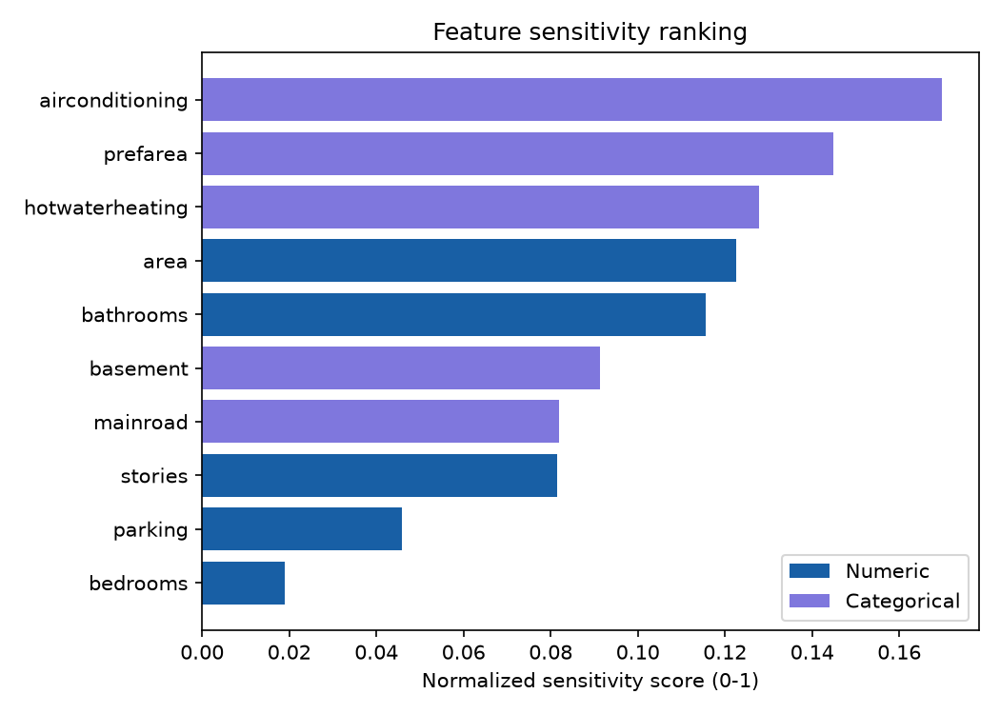

The following examples illustrate specific real scenarios and highlight the most influential factors affecting each prediction. 

<table style="width:100%; border-collapse:collapse;"><tr><td style="width:50%; padding:8px; vertical-align:top;">
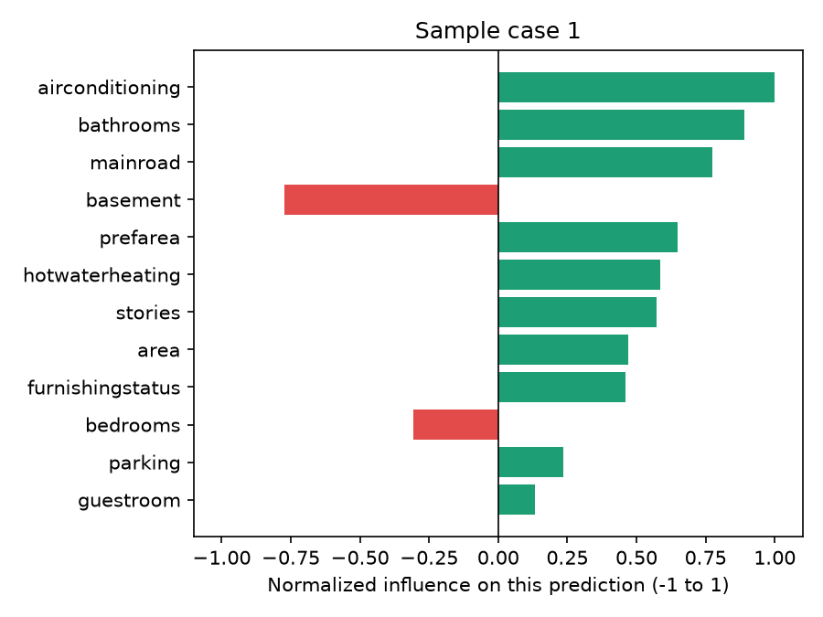
<strong>Input values:</strong>
<ul style="font-size:12px; margin:4px 0; padding-left:18px;"><li><strong>area</strong>: 1,892.00</li><li><strong>bedrooms</strong>: 3.00</li><li><strong>bathrooms</strong>: 2.00</li><li><strong>stories</strong>: 2.00</li><li><strong>parking</strong>: 1.00</li><li><strong>mainroad</strong>: yes</li><li><strong>guestroom</strong>: no</li><li><strong>basement</strong>: no</li><li><strong>hotwaterheating</strong>: yes</li><li><strong>airconditioning</strong>: yes</li><li><strong>prefarea</strong>: yes</li><li><strong>furnishingstatus</strong>: furnished</li></ul>
<strong>Predicted value:</strong> 6,521,283.76

</td><td style="width:50%; padding:8px; vertical-align:top;">
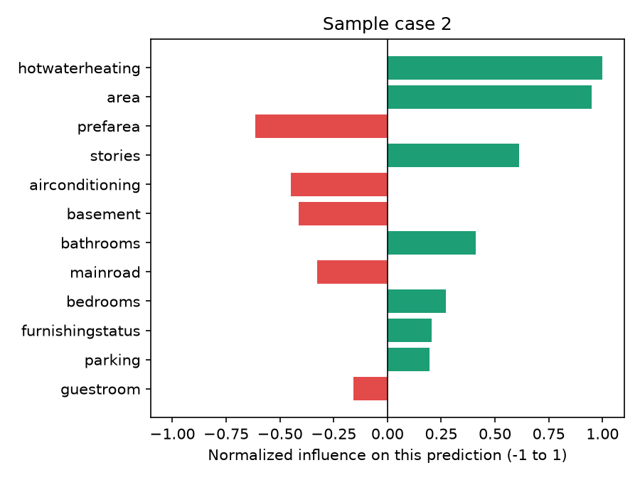
<strong>Input values:</strong>
<ul style="font-size:12px; margin:4px 0; padding-left:18px;"><li><strong>area</strong>: 10,250.00</li><li><strong>bedrooms</strong>: 5.00</li><li><strong>bathrooms</strong>: 3.00</li><li><strong>stories</strong>: 3.00</li><li><strong>parking</strong>: 2.00</li><li><strong>mainroad</strong>: no</li><li><strong>guestroom</strong>: yes</li><li><strong>basement</strong>: no</li><li><strong>hotwaterheating</strong>: yes</li><li><strong>airconditioning</strong>: no</li><li><strong>prefarea</strong>: no</li><li><strong>furnishingstatus</strong>: semi-furnished</li></ul>
<strong>Predicted value:</strong> 8,712,898.01

</td></tr></table>

The charts below show how the predicted output changes as each factor varies, while other factors remain typical of the dataset.

<table style="width:100%; border-collapse:collapse;"><tr><td style="width:50%; padding:8px; vertical-align:top;">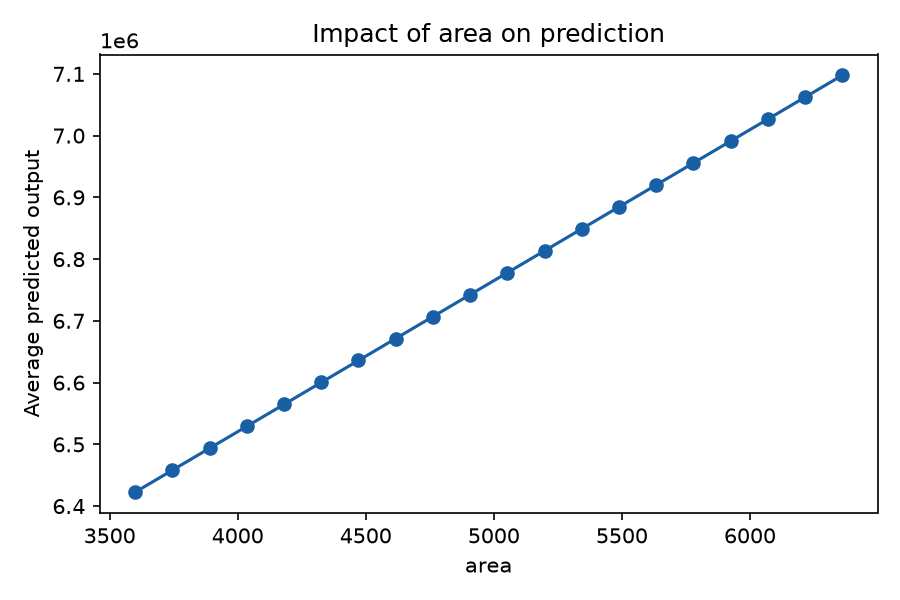
<strong>area</strong>
</td><td style="width:50%; padding:8px; vertical-align:top;">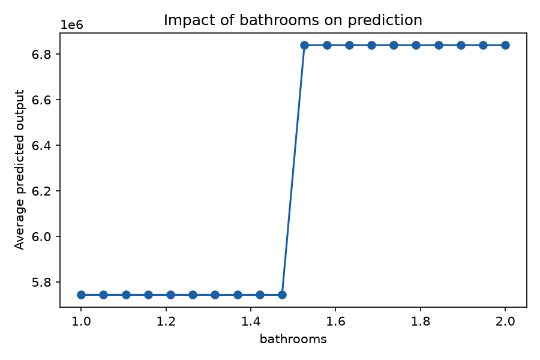
<strong>bathrooms</strong>
</td></tr></table>

<table style="width:100%; border-collapse:collapse;"><tr><td style="width:50%; padding:8px; vertical-align:top;">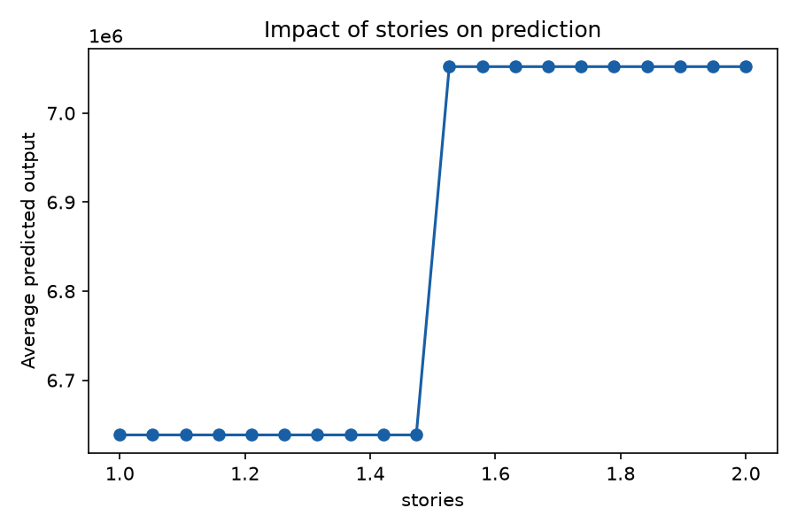
<strong>stories</strong>
</td><td style="width:50%; padding:8px; vertical-align:top;">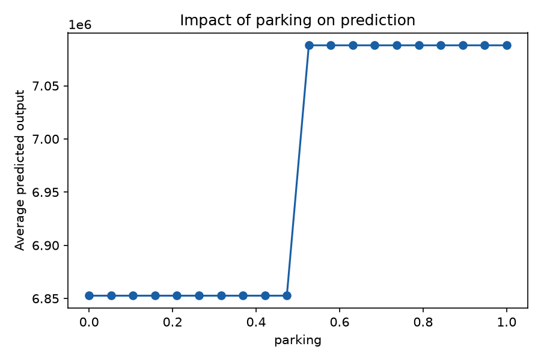
<strong>parking</strong>
</td></tr></table>

<table style="width:100%; border-collapse:collapse;"><tr><td style="width:50%; padding:8px; vertical-align:top;">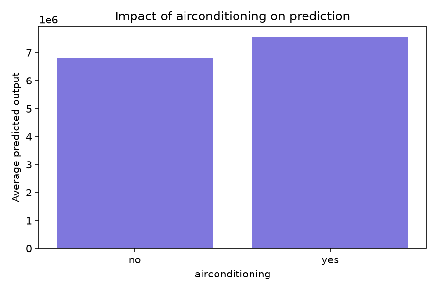
<strong>airconditioning</strong>
</td><td style="width:50%; padding:8px; vertical-align:top;">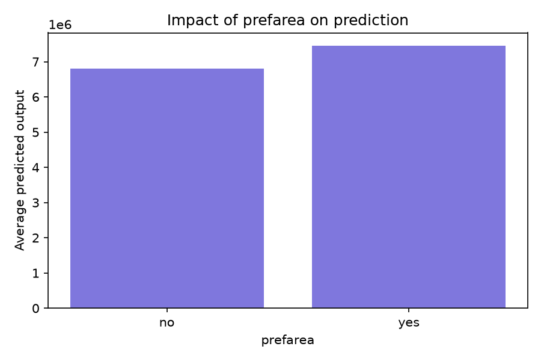
<strong>prefarea</strong>
</td></tr></table>

<table style="width:100%; border-collapse:collapse;"><tr><td style="width:50%; padding:8px; vertical-align:top;">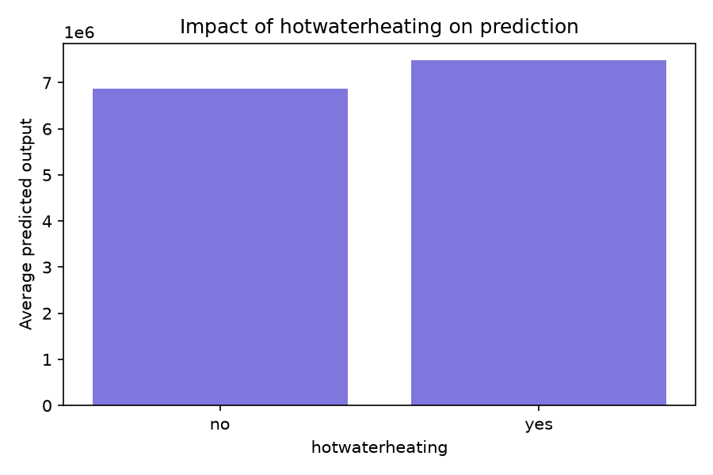
<strong>hotwaterheating</strong>
</td><td style="width:50%; padding:8px; vertical-align:top;">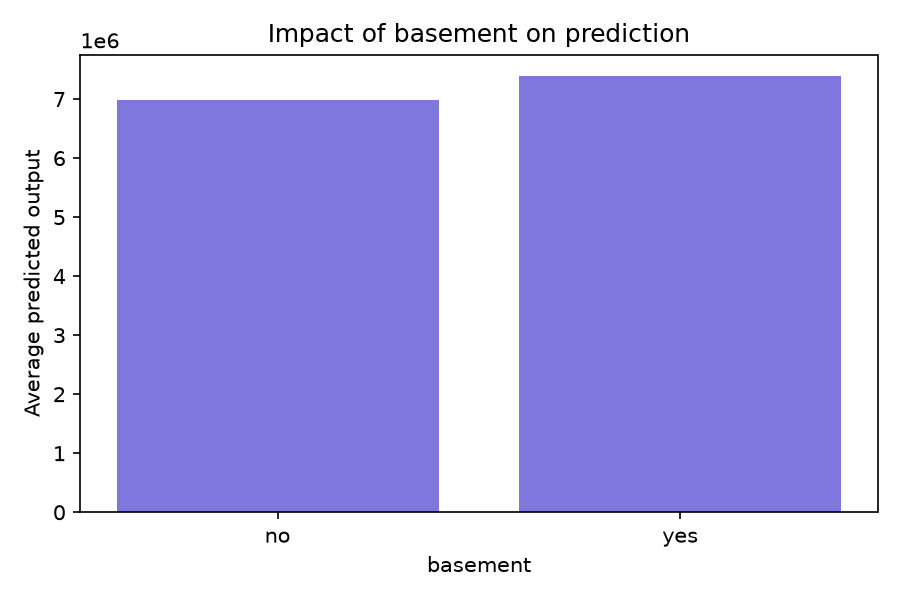
<strong>basement</strong>
</td></tr></table>

These results serve as a starting point for further review and analysis of the model's performance and the factors influencing its predictions.